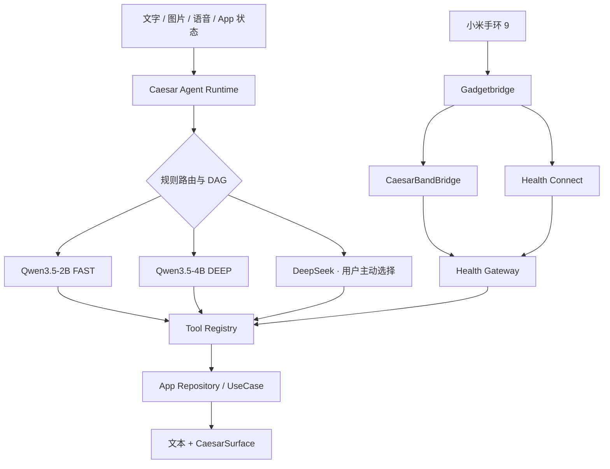

# Caesar∞

Caesar∞ 是一款以本地优先为核心的 Android 私人 Agent：同一个应用里组合端侧多模态模型、类型化 App 工具、可确认记忆、Health Connect、小米手环桥接，以及 SPECTRA / OpticalGlass 原生界面。

> **当前状态：V1 开发分支。** 主要目标设备为 Xiaomi 15 Pro（Android 16、16 GB RAM）。模型权重、个人密钥、健康原始序列、设备日志和调试 APK 均不进入仓库。Band 9 私有协议与 Gadgetbridge 兼容性仍有实验边界；Caesar∞ 当前也**没有通用网页搜索或任意 URL 浏览能力**。

## 能做什么

| 能力 | 当前实现 | 边界 |
| --- | --- | --- |
| 本地 Agent | Qwen3.5-2B FAST 与 Qwen3.5-4B DEEP，MNN Q4，按会话锁定模型 | 两个模型可独立下载，不同时常驻 |
| 多模态 | 文字、相册、拍照、截图分享、OCR 辅助、语音输入与 TTS | 图片和设备私密上下文强制本地；V1 不持续监听或录像 |
| App 工具 | 类型化 Tool Registry、DAG、参数校验、确认、幂等与结果卡片 | 模型不能访问裸 SQL、令牌、任意网络或原始蓝牙命令 |
| 个性化 | 短期任务上下文、结构化摘要、可确认长期记忆 | 记忆可查看和删除；健康原始序列不写入长期记忆 |
| 健康感知 | Health Connect 聚合、来源与新鲜度、首页折叠卡、Agent 健康工具 | 缺失指标不会伪造成已测量值；“今日无记录”可按展示规则显示 0 |
| Band 9 | 独立 CaesarBandBridge APK、签名保护 IPC、Gadgetbridge 同步触发与诊断 | 稳定历史数据以 Health Connect 为准；实时 HR/步数取决于 Bridge 已声明能力 |
| 动态界面 | 类型化 CaesarSurface Compose Renderer、A2UI 稳定子集适配 | 未知组件、任意 URI、代码、SQL 和未注册 action 会被拒绝 |
| 联网 | Supabase 业务数据；用户主动选择时直连 DeepSeek | 本地模型不会自行联网；尚无 `web.search` / `web.open` 工具 |

产品界面已从校园平台调整为私人应用语义：社区对应“树洞”，市场对应“心愿墙”，“我的”页面不展示订单入口。仓库中保留 `CampusAI` 包名、目录名和部分内部类型名，仅用于升级与数据库兼容。

## 架构



内部 Agent 直接调用 Repository / UseCase。AppFunctions 只是对外安全适配层，MCP 不用于同进程通信；这样可以减少序列化、权限绕行和额外攻击面。

## 快速构建

需要：

- JDK 21
- Android SDK 36.1
- Android NDK `28.2.13676358`
- CMake `3.22.1`
- Node.js 24（仅管理台）
- Docker（仅本地完整回放 Supabase migration 时需要）

```powershell
# Android 主应用、Band Bridge 与核心检查
.\gradlew.bat `
  :apps:android:app:testDebugUnitTest `
  :apps:android:app:assembleDebug `
  :apps:android:bandbridge:testDebugUnitTest `
  :apps:android:bandbridge:lintDebug `
  :apps:android:bandbridge:assembleDebug

# Web 管理台
Set-Location apps/admin
npm ci
npm run build
npm run test
```

Robolectric 首次运行会下载对应 Android SDK 测试包；在网络受限环境中，可先运行目标测试类和 `assembleDebug`，不要把依赖下载超时误判为源码失败。不要在物理手机上运行 `connectedDebugAndroidTest`。

## 配置本地模型

模型权重不在 Git 仓库，也不打入 APK。应用首次安装后，由用户在“我的 → AI 运行方式”分别下载：

| 模式 | 模型 | 定位 |
| --- | --- | --- |
| FAST | Qwen3.5-2B MNN Q4 | 日常对话、简单读取与低功耗任务 |
| DEEP | Qwen3.5-4B MNN Q4 | 多步骤工具、视觉理解与复杂规划 |

下载器支持 Wi-Fi 约束、断点续传、进程恢复、逐文件 SHA-256、原子切换、暂停和按模型独立删除。切换默认档位只影响新会话，不会中断另一个模型的下载，也不会在会话中静默换权重。

## 配置联网能力

Caesar∞ 当前有两类受控网络入口：

1. **Supabase**：登录、树洞、心愿墙、资料与同步等应用业务。
2. **DeepSeek**：用户在设备上保存自己的 Key，并主动选择 DeepSeek 时，Android 直接请求固定域名 `api.deepseek.com`。

DeepSeek Key 使用 Android Keystore 加密、不参与备份、不上传 Supabase。图片、健康、手环和明确的设备私密上下文不会自动发送到云端。

目前没有把 OkHttp、WebView、浏览器 Cookie 或任意 URL 暴露给模型。计划中的通用联网会以有限工具实现：

- `web.search(query, recency, domains)`：返回来源、摘要和抓取时间；
- `web.open(url)`：只允许 HTTPS，并校验重定向、私网地址、响应类型、大小和超时；
- 登录、下载、发布、支付继续使用独立工具与原生确认，不与只读搜索混用。

网页、搜索结果和附件始终作为不可信数据，不能修改系统指令、权限、记忆规则或工具风险级别。

## 接入 Health Connect 与 Band 9

稳定链路：

```text
Band 9 → Gadgetbridge → Health Connect → Caesar Health Gateway
                    ↘ CaesarBandBridge → 签名保护状态 IPC
```

使用顺序：

1. 在 Gadgetbridge 中完成真实 Band 9 配对和历史同步；不要从调试页面添加测试设备。
2. 在 Health Connect 给 Gadgetbridge 写权限、给 Caesar∞ 读权限。
3. 安装与主应用同签名的 CaesarBandBridge。
4. 在 Caesar∞ 首页健康卡中刷新；详细来源、同步时间、连接状态和诊断位于折叠详情。

手环有数据不等于 Gadgetbridge 一定能为当前固件解析并导出相同记录。V1 不承诺实时 SpO₂、实时压力、血压、VO₂max 或完整睡眠状态；不支持的实时能力必须显示为不可用，不能填入伪造值。

## 仓库结构

```text
apps/android/app/            Caesar∞ Android 主应用
apps/android/band-contract/  主应用与 Bridge 的稳定契约
apps/android/bandbridge/     独立 Band 伴侣 APK
apps/admin/                  React / TypeScript 管理台
supabase/                    migration、RLS、RPC 与 Edge Functions
design/                      SPECTRA、品牌与视觉验收规范
docs/                        Agent、隐私、模型、性能和发布文档
scripts/                     受控评测、设备测试与数据诊断脚本
```

## 隐私与安全

- 本地模型没有裸网络、Shell、SQL 或 BLE/SPP 权限。
- 工具在执行前进行结构、类型、风险和幂等校验。
- 外发、不可逆、权限和账户安全操作必须经过代码策略；高风险操作使用系统确认或生物识别。
- Prompt、图片、帖子、网页和工具结果都不能覆盖系统策略。
- 日志和 Trace 不保存密码、令牌、配对密钥、原始健康序列或模型思维链。
- `artifacts/`、模型权重、本机报告和设备抓取内容已被 Git 忽略。

Band Bridge 只使用公开可观察的 Android / Gadgetbridge Intent 边界与自有高层契约。若分发 Gadgetbridge 派生组件或复制其实现，必须另行完成 AGPL 与署名审查。

## 当前验证

本分支已完成：

- Android 主应用与 CaesarBandBridge debug APK 构建；
- arm64 MNN JNI 编译与链接；
- Band Bridge lint；
- 输出守卫、生成代次、路由并发、本地/云选择、健康证据和健康展示定向测试；
- 2B / 4B 独立下载、Agent 闭环、幂等、图片、语音、Health Connect 与数据库迁移测试源码。

完整 JVM 套件仍需在 Robolectric Android 36 测试包可正常下载的环境中复跑。真机 Band 9 的长期稳定连接、全部固件历史解析和实时指标也仍是发布门禁，仓库不会把实验结果写成已稳定支持。

## 进一步阅读

- [本地 Agent 架构](docs/local-ai-architecture.md)
- [AI 路由与隐私](docs/ai-routing-privacy.md)
- [本地模型用户指南](docs/local-ai-user-guide.md)
- [Caesar Eval](docs/caesar-eval.md)
- [图片、时间提示与视觉](docs/ai-time-prompts-and-vision.md)
- [性能与真机门槛](docs/local-ai-performance.md)
- [安全审计](docs/security-audit.md)
- [上线接管](docs/live-cutover.md)
- [SPECTRA / OpticalGlass 设计](design/caesar-adaptive-field-v1.md)
