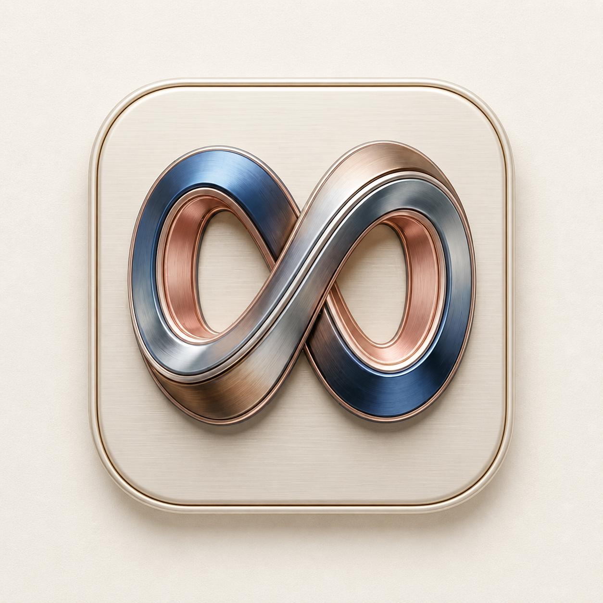
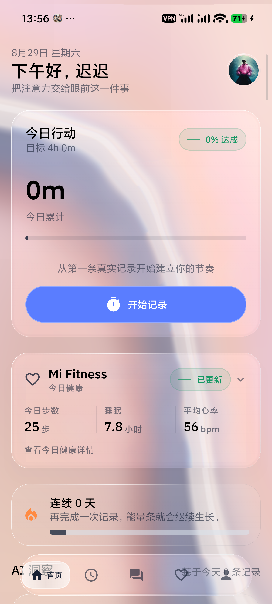
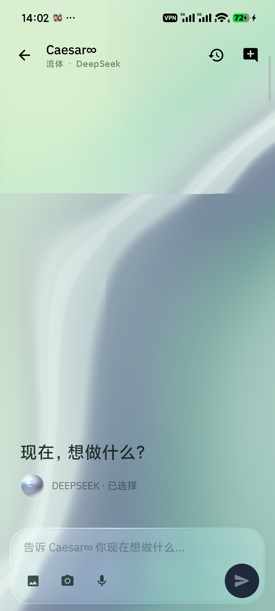
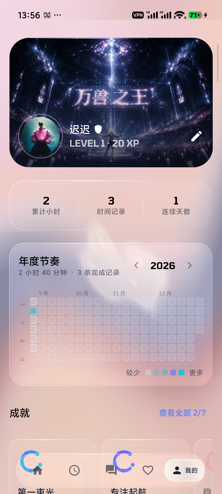
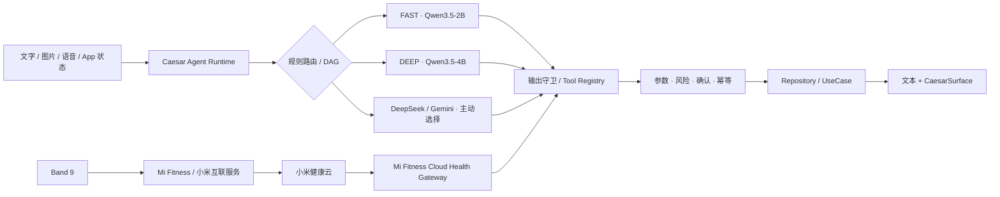

<p align="center">
  
</p>

<h1 align="center">Caesar∞</h1>

<p align="center"><strong>一个只属于你的、本地优先 Android 私人 Agent。</strong></p>

<p align="center">
  双端侧模型 · 本地多模态 · DeepSeek / Gemini · 可确认记忆 · Mi Fitness 健康自动化
</p>

<p align="center">
  <a href="#快速开始">快速开始</a> ·
  <a href="#v2-能做什么">能力边界</a> ·
  <a href="#模型与联网">模型与联网</a> ·
  <a href="#小米手环与健康数据">手环接入</a> ·
  <a href="docs/local-ai-architecture.md">架构文档</a>
</p>

> [!IMPORTANT]
> **`v2.0.1` 是 Caesar∞ 当前的源码与发布基线。** 当前重点适配 Xiaomi 15 Pro（Android 16、16 GB RAM）。模型权重、个人密钥、健康原始序列、设备日志和调试 APK 均不会进入仓库。请只从 [Releases](https://github.com/liburce0412-alt/Caesar-Infinity/releases) 下载同时提供 SHA-256 的正式 APK；如果某个版本没有 APK，表示发布签名尚未配置，请按源码构建，不要安装第三方重打包文件。

## V2 是什么

Caesar∞ 把模型、工具、个人上下文和原生界面放进同一个受控运行时。模型负责理解与规划，代码负责权限、参数、确认、幂等和真实执行；动态数据始终来自 App、Health Connect 或明确授权的网络入口，而不是写进模型权重。

产品语义已经从校园平台迁移为私人应用：社区成为「树洞」，市场成为「心愿墙」，「我的」页面不再展示订单入口。仓库仍保留部分 `CampusAI` 包名、目录名和内部类型名，以维持安装升级与数据库兼容。

### 设计原则

- **本地优先**：图片、健康、手环与设备私密上下文默认留在手机。
- **能力透明**：Agent 只能使用注册工具；没有裸 SQL、Shell、任意网络或原始 BLE/SPP 权限。
- **所有者可控**：长期记忆先提议、后确认，并且可查看、修改、导出和删除。
- **单一视觉场**：SPECTRA 提供全局流体环境，OpticalGlass 只用于高优先级区域，正文与图标保持锐利。
- **不伪造状态**：缺失健康指标保持缺失；明确的「今日无记录」才可按展示规则显示 `0`。

## V2 能做什么

| 能力 | V2 实现 | 明确边界 |
| --- | --- | --- |
| 本地 Agent | Qwen3.5-2B FAST 与 Qwen3.5-4B DEEP，MNN Q4，按会话锁定 | 两个模型独立下载，不同时常驻，也不会在会话中静默换模 |
| 多模态 | 文字、相册、拍照、截图分享、OCR 辅助、语音输入与 TTS | V2 不持续监听、持续摄像或理解视频 |
| App 工具 | Tool Registry、DAG、类型校验、确认、幂等与动态结果卡片 | 模型不能绕过 Repository / UseCase 直接碰数据库或令牌 |
| 个人记忆 | 短期任务状态、结构化摘要、确认式长期记忆 | 原始健康序列不写入记忆；拒绝后不落库 |
| 健康感知 | Health Connect 聚合、来源、新鲜度、首页折叠卡和 Agent 健康工具 | Caesar∞ 解释状态与趋势，不提供医疗诊断 |
| 小米手环健康 | Mi Fitness 每日健康汇总、步数分时趋势与本机加密缓存 | 新鲜度取决于 Mi Fitness 先完成手环到云端的同步；CampusAI 不建立 BLE/SPP 连接 |
| 健康自动化 | App 前台按间隔只读检查 Mi Fitness 云端；数据变化时由锁定的 DeepSeek 或 Gemini 模型生成 2–3 条短消息 | 必须显式允许必要日汇总；不后台唤醒、不发送分钟级数据，也不静默换模 |
| 动态界面 | 类型化 CaesarSurface Compose Renderer、A2UI 稳定子集适配 | 未知组件、任意 URI、代码、SQL 与未注册 `actionId` 会被拒绝 |
| 受控联网 | Supabase 业务数据；用户主动选择时直连 DeepSeek 或 Google Gemini | 本地模型不会自行联网；V2 没有通用 `web.search` / `web.open` |

## 真机预览

<p align="center">
  <a href="design/readme/caesar-home.png"></a>&nbsp;
  <a href="design/readme/caesar-ai.png"></a>&nbsp;
  <a href="design/readme/caesar-profile.png"></a>
</p>

<p align="center"><sub>首页 · 行动与健康　｜　AI · Aurora 森屿　｜　个人页 · 年度节奏</sub></p>

## 从一句话到一次可靠执行



内部 Caesar 直接调用 App 的 Repository / UseCase。AppFunctions 是面向系统的安全适配层；MCP 不用于同进程通信，以减少序列化、权限绕行和额外攻击面。

## 快速开始

### 环境要求

- JDK 21
- Android SDK 36.1
- Android NDK `28.2.13676358`
- CMake `3.22.1`
- Node.js 24（仅管理台）
- Docker（仅本地完整回放 Supabase migration）

### 构建 Android

```powershell
.\gradlew.bat `
  :apps:android:app:testDebugUnitTest `
  :apps:android:app:lintDebug `
  :apps:android:app:assembleDebug
```

Robolectric 首次运行会下载对应 Android SDK 测试包。在网络受限环境中，可以先运行目标测试类和 `assembleDebug`；不要把依赖下载超时误判成源码失败，也不要在物理手机上运行 `connectedDebugAndroidTest`。

### 构建管理台

```powershell
Set-Location apps/admin
npm ci
npm run build
npm run test
```

## 模型与联网

### 下载本地模型

模型权重不在 Git 仓库，也不打入 APK。安装后前往「我的 → AI 运行方式」分别下载：

| 模式 | 模型 | 适合 |
| --- | --- | --- |
| FAST | Qwen3.5-2B MNN Q4 | 日常对话、简单读取、低功耗任务 |
| DEEP | Qwen3.5-4B MNN Q4 | 多步骤工具、视觉理解、复杂规划 |

下载器支持 Wi-Fi 约束、断点续传、进程恢复、逐文件 SHA-256、原子切换、暂停和按模型独立删除。切换默认档位只影响新会话，不会暂停另一个模型的下载。

### 使用网络

Caesar∞ V2 只有两类受控网络入口：

1. **Supabase**：登录、树洞、心愿墙、资料与同步等应用业务。
2. **Agent Provider**：用户在设备上分别保存自己的 DeepSeek 或 Google Gemini Key，并在发起请求前显式选择 Provider。

两类 Provider Key 均使用 Android Keystore 加密、不参与备份、不上传 Supabase。图片、手环设备信息和分钟级健康原始数据不会发送到云端；仅在用户本次明确勾选“附带健康摘要”时，才附带必要的当日汇总。

健康自动化中不再手填模型 ID。保存对应个人 Key 后，App 会读取 DeepSeek 或 Google Gemini 账户的实时可用模型列表；切换 Provider 时分别保留当前选择。启用或保存前会再次在线验证，任务随后锁定所选模型，不会静默切换。若模型目录暂时不可用或所选模型已经下线，原选择会保留，但必须刷新并重新选择后才能保存。

当前没有把 OkHttp、WebView、浏览器 Cookie 或任意 URL 暴露给模型。未来若加入通用联网，会以有限的只读 `web.search` / `web.open` 工具实现，并对 HTTPS、重定向、私网地址、响应类型、大小和超时做代码校验。网页内容始终视为不可信数据，不能修改系统指令、权限、记忆规则或工具风险级别。

## 小米手环与健康数据

当前只读链路：

```text
Band 9 → Mi Fitness / 小米互联服务 → 小米健康云 → CampusAI 只读健康缓存
```

接入顺序：

1. 保持 Mi Fitness 与小米互联服务正常运行，先在 Mi Fitness 中完成手环同步。
2. 在 CampusAI 设置中显式保存本机加密的小米账户凭据。
3. 点击手动刷新，只读获取当天官方日汇总；缓存未命中时不会用 0 或其他数据源冒充。
4. 在首页健康卡查看指标、来源、状态与最近同步时间。
5. 如需定时检查，在「我的 → 健康自动化」选择 DeepSeek 或 Gemini 的实时可用模型，并明确授权必要的今日汇总。

该链路不会抢占手环的蓝牙连接。云端暂无、部分、过期或读取失败的指标会显示明确状态，不会填入伪造值。历史逆向调研保留在 `docs/` 和 `work/` 中，但 Gadgetbridge/CaesarBandBridge 已不是产品运行链路。

## 仓库地图

```text
apps/android/app/            Caesar∞ Android 主应用
apps/admin/                  React / TypeScript 管理台
supabase/                    migration、RLS、RPC 与 Edge Functions
design/                      SPECTRA、品牌与视觉验收规范
docs/                        Agent、隐私、模型、性能和发布文档
scripts/                     评测、设备测试与数据诊断脚本
```

## 隐私与安全

- 本地模型没有裸网络、Shell、SQL 或 BLE/SPP 权限。
- 工具执行前经过结构、类型、风险和幂等校验。
- 外发、不可逆、权限和账户安全操作由代码策略保护；高风险操作使用系统确认或生物识别。
- Prompt、图片、帖子、网页和工具结果都不能覆盖系统策略。
- 日志与 Trace 不保存密码、令牌、配对密钥、原始健康序列或模型思维链。
- `artifacts/`、模型权重、本机报告和设备抓取内容已被 Git 忽略。

小米云凭据与健康摘要使用 Android Keystore 包装的本机加密存储，并排除在备份和设备迁移之外。

## V2 验证状态

已完成：

- Android 主应用 debug 构建；
- arm64 MNN JNI 编译与链接；
- 输出守卫、生成代次、路由并发、本地/云选择、健康证据、前台健康自动化和 Provider 实时模型目录定向测试；
- 2B / 4B 独立下载、Agent 闭环、幂等、图片、语音、Health Connect 与数据库迁移测试源码。

仍需长期验证：

- Mi Fitness 私有云端接口的长期兼容性、限流恢复和各指标的真机对照；
- dark mode、全部 SPECTRA 环境、低质量档与长期热表现；
- Robolectric Android 36 测试依赖在所有网络环境中的稳定获取。

## 进一步阅读

- [本地 Agent 架构](docs/local-ai-architecture.md)
- [AI 路由与隐私](docs/ai-routing-privacy.md)
- [本地模型用户指南](docs/local-ai-user-guide.md)
- [Caesar Eval](docs/caesar-eval.md)
- [图片、时间提示与视觉](docs/ai-time-prompts-and-vision.md)
- [性能与真机门槛](docs/local-ai-performance.md)
- [安全审计](docs/security-audit.md)
- [上线接管](docs/live-cutover.md)
- [SPECTRA / OpticalGlass 设计](design/caesar-adaptive-field-v1.md)
- [v2.0.1 发布说明](docs/releases/v2.0.1.md)
- [v2.0.0 发布说明](docs/releases/v2.0.0.md)
- [v1.0.0 历史发布说明](docs/releases/v1.0.0.md)

## 许可

本仓库当前未附加开源许可证，默认保留所有权利。源码可见不等于获得复制、修改或再分发授权；如需协作或分发，请先联系仓库所有者。
