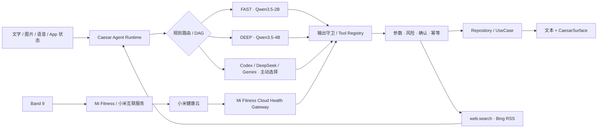

<p align="center">
  
</p>

<h1 align="center">Caesar∞</h1>

<p align="center"><strong>一个只属于你的、本地优先 Android 私人 Agent。</strong></p>

<p align="center">
  双端侧模型 · Codex / DeepSeek / Gemini · 多模态 · 可控网页搜索 · Mi Fitness 健康自动化
</p>

<p align="center">
  <a href="#快速开始">快速开始</a> ·
  <a href="#v2-能做什么">能力边界</a> ·
  <a href="#模型与联网">模型与联网</a> ·
  <a href="#小米手环与健康数据">手环接入</a> ·
  <a href="docs/local-ai-architecture.md">架构文档</a>
</p>

> [!IMPORTANT]
> **`v2.0.1` 是 Caesar∞ 当前的源码与发布基线。** 当前重点适配 Xiaomi 15 Pro（Android 16、16 GB RAM）。模型权重、个人密钥、健康原始序列、设备日志和调试 APK 均不会进入仓库。请只从 [Releases](https://github.com/liburce0412-alt/Caesar-Infinity/releases) 下载同时提供 SHA-256 的正式 APK；如果某个版本没有 APK，表示发布签名尚未配置，请按源码构建，不要安装第三方重打包文件。

## V2 是什么

Caesar∞ 把模型、工具、个人上下文和原生界面放进同一个受控运行时。模型负责理解与规划，代码负责权限、参数、确认、幂等和真实执行；动态数据始终来自 App、Health Connect 或明确授权的网络入口，而不是写进模型权重。

产品语义已经从校园平台迁移为私人应用：社区成为「树洞」，市场成为「心愿墙」，「我的」页面不再展示订单入口。仓库仍保留部分 `CampusAI` 包名、目录名和内部类型名，以维持安装升级与数据库兼容。

### 设计原则

- **本地留存**：对话记录、导入图片与个人上下文保存在设备上，不建立类似 ChatGPT 的云端会话，也不把历史同步到 Provider。
- **能力透明**：Agent 只能使用注册工具；没有裸 SQL、Shell、任意网络或原始 BLE/SPP 权限。选择云端模型时，当轮必要消息会发送给所选 Provider；选择 Codex 时，当前新附图片默认随请求上传。
- **所有者可控**：长期记忆先提议、后确认，并且可查看、修改、导出和删除。
- **单一视觉场**：SPECTRA 提供全局流体环境，OpticalGlass 只用于高优先级区域，正文与图标保持锐利。
- **不伪造状态**：缺失健康指标保持缺失；明确的「今日无记录」才可按展示规则显示 `0`。

## V2 能做什么

| 能力 | V2 实现 | 明确边界 |
| --- | --- | --- |
| 本地 Agent | Qwen3.5-2B FAST 与 Qwen3.5-4B DEEP，MNN Q4，按会话锁定 | 两个模型独立下载，不同时常驻，也不会在会话中静默换模 |
| 多模态 | 文字、相册、拍照、截图分享、OCR 辅助、语音输入与 TTS；明确选择 Codex 时默认上传当前轮图片 | Codex 每轮最多 4 张，经旋转校正、缩放、JPEG 重编码并移除 EXIF；不持续监听、持续摄像或理解视频 |
| App 工具 | 32 个 App 工具与 1 个只读 `web.search`，Tool Registry、DAG、类型校验、确认、幂等与动态结果卡片 | 模型不能绕过 Repository / UseCase 直接碰数据库或令牌；每轮只投影与意图相关的工具 |
| 个人记忆 | 短期任务状态、结构化摘要、确认式长期记忆 | 原始健康序列不写入记忆；拒绝后不落库 |
| 健康感知 | Health Connect 聚合、来源、新鲜度、首页折叠卡和 Agent 健康工具 | Caesar∞ 解释状态与趋势，不提供医疗诊断 |
| 小米手环健康 | Mi Fitness 每日健康汇总、步数分时趋势与本机加密缓存 | 新鲜度取决于 Mi Fitness 先完成手环到云端的同步；CampusAI 不建立 BLE/SPP 连接 |
| 健康自动化 | App 前台按间隔只读检查 Mi Fitness 云端；数据变化时由锁定的 DeepSeek 或 Gemini 模型生成 2–3 条短消息 | 必须显式允许必要日汇总；不后台唤醒、不发送分钟级数据，也不静默换模 |
| 动态界面 | 类型化 CaesarSurface Compose Renderer、A2UI 稳定子集适配 | 未知组件、任意 URI、代码、SQL 与未注册 `actionId` 会被拒绝 |
| 受控联网 | Supabase 业务数据；直连 DeepSeek、Google Gemini 或 OpenAI-compatible Codex；云端 Agent 可调用只读 `web.search` | 搜索只发送查询词并读取 Bing RSS 摘要，不抓取结果网页、浏览器 Cookie 或任意 URL；没有 `web.open` |

## 真机预览

<p align="center">
  <a href="design/readme/caesar-home.png"></a>&nbsp;
  <a href="design/readme/caesar-ai.png"></a>&nbsp;
  <a href="design/readme/caesar-profile.png"></a>
</p>

<p align="center"><sub>首页 · 行动与健康　｜　AI · Aurora 森屿　｜　个人页 · 年度节奏</sub></p>

## 从一句话到一次可靠执行



内部 Caesar 直接调用 App 的 Repository / UseCase。AppFunctions 是面向系统的安全适配层；MCP 不用于同进程通信，以减少序列化、权限绕行和额外攻击面。

## 快速开始

### 环境要求

- JDK 21
- Android SDK 36.1
- Android NDK `28.2.13676358`
- CMake `3.22.1`
- Node.js 24（仅管理台）
- Docker（仅本地完整回放 Supabase migration）

### 构建 Android

```powershell
.\gradlew.bat `
  :apps:android:app:testDebugUnitTest `
  :apps:android:app:lintDebug `
  :apps:android:app:assembleDebug
```

Robolectric 首次运行会下载对应 Android SDK 测试包。在网络受限环境中，可以先运行目标测试类和 `assembleDebug`；不要把依赖下载超时误判成源码失败，也不要在物理手机上运行 `connectedDebugAndroidTest`。

### 构建管理台

```powershell
Set-Location apps/admin
npm ci
npm run build
npm run test
```

## 模型与联网

### 下载本地模型

模型权重不在 Git 仓库，也不打入 APK。安装后前往「我的 → AI 运行方式」分别下载：

| 模式 | 模型 | 适合 |
| --- | --- | --- |
| FAST | Qwen3.5-2B MNN Q4 | 日常对话、简单读取、低功耗任务 |
| DEEP | Qwen3.5-4B MNN Q4 | 多步骤工具、视觉理解、复杂规划 |

下载器支持 Wi-Fi 约束、断点续传、进程恢复、逐文件 SHA-256、原子切换、暂停和按模型独立删除。切换默认档位只影响新会话，不会暂停另一个模型的下载。

### 使用网络

Caesar∞ V2 有三类受控网络入口：

1. **Supabase**：登录、树洞、心愿墙、资料与相关应用业务。
2. **Agent Provider**：用户在设备上保存自己的 DeepSeek、Google Gemini 或 Codex Key；发起云端生成时，把完成这一轮所需的 `messages` 直接发送给所选 Provider。
3. **网页搜索**：云端 Agent 可以调用 App 注册的只读 `web.search`。App 只把搜索词发送给 Bing RSS，不发送整段会话，也不打开搜索结果网页。

Provider Key 使用 Android Keystore 包装的 AES-256-GCM 加密存储，不参与备份或设备迁移，不上传 Supabase，也不写入源码、日志、崩溃报告或分析平台。App 的 Room 对话数据库同样排除备份：历史只用于本机继续对话，不创建或同步类似 ChatGPT 的服务端会话。不过，云端模型每次生成仍必须收到完成当轮推理所需的消息；Provider 或搜索服务在服务端如何记录请求，取决于对应服务本身的部署与政策。

保存个人 Key 后，App 会实时调用各 Provider 的 `/models`，不硬编码可选模型目录；切换 Provider 时分别保留当前选择。若目录暂时不可用或所选模型已经下线，App 会保留原选择并要求刷新，不静默切换模型。

### Codex OpenAI-compatible Provider

Codex 通过标准 OpenAI-compatible 协议直接接入，不需要管理面板、注册系统或 Caesar∞ 专用后端：

| 项目 | 当前实现 |
| --- | --- |
| Provider 名称 | `Codex` |
| 默认 Base URL | `https://node.tail9a6cbb.ts.net/v1`，可在设置中修改，只接受 HTTPS |
| 鉴权 | `Authorization: Bearer <API_KEY>`；Key 由用户在 App 内手动输入 |
| 模型目录 | `GET /models`，动态获取完整可用列表 |
| 对话 | `POST /chat/completions`，支持 `stream=true` 的 SSE |
| 默认模型 | `gpt-5.6-sol`；只有服务端目录实际返回该模型时才可选用 |
| 超时与中断 | 连接、写入至少 120 秒，流式读取 130 秒；停止生成会取消当前 Call，提前断流会显示可重试错误 |

Codex 与其他云端 Provider 共用 Caesar∞ 的多轮消息、FAST / DEEP 模式、Markdown、代码块、流式输出、停止生成、重新生成、工具调用、结果卡片和本机历史。Base URL、Key、所选模型和“测试连接”均位于「我的 → AI 运行方式」；更换 Codex Base URL 时会清除旧地址绑定的 Key，避免把凭据误发给新的服务端。

“测试连接”直接做三段无副作用验证，而不是只检查 HTTP 是否可达：

1. 带 Bearer Key 调用 `GET /models`，确认所选模型真实存在；
2. 调用流式 `POST /chat/completions`，发送“只回复 OK”，要求完整收到 `[DONE]` 且正文精确为 `OK`；
3. 向模型提供一个只读诊断工具并要求发起 `tool_calls`，校验工具名、参数和流式组装，不读取或修改任何 App 数据。

任一阶段失败都会单独报错，不会把“模型列表成功”误报成“真实对话与工具均可用”。Codex 服务端必须正确实现 OpenAI-compatible 的多模态消息与 `tool_calls`，才能启用对应能力。

#### Codex 默认图片输入

明确选择 Codex 后，用户本轮从相册、相机、截图分享添加的图片会默认随该轮请求上传，无需再打开一次性授权。图片在设备上先完成方向校正、最长边 1600 px 缩放、JPEG 90 重编码与 EXIF 移除，再以 OpenAI-compatible `image_url` Data URL 放入用户消息；每轮最多 4 张，单张云端载荷上限 4 MiB、合计上限 8 MiB。

只上传当前新附图片，不重传历史消息保存的图片，不把本地文件路径写进网络请求，也不把 Base64 写入 Room。LOCAL、AUTO、DeepSeek 和 Gemini 维持各自原有图片路由；只有用户明确把 Provider 选为 Codex 时启用这条默认上传路径。

#### 云端联网搜索

`web.search` 是 Caesar∞ App 通过 `tool_calls` 暴露的客户端工具，不是假设模型“天然联网”，也不是 Provider 私有接口。当前实现使用固定 HTTPS Bing RSS 搜索端点：

- 每次只发送模型给出的搜索词；搜索词最长约 200 字符，不附带完整对话、图片、Key 或本机资料；
- 默认返回最多 5 条，代码硬上限 8 条；响应体上限 512 KiB，连接、读写超时 25 秒；
- HTTP 客户端不自动跟随重定向；仅允许一次严格校验的 Bing 官方区域跳转（HTTPS、标准端口、固定主机与 `/search` 路径），外站跳转会安全停止；
- 只提取并清洗标题、摘要和结果 URL，不打开正文、不携带浏览器 Cookie，也不允许模型访问任意 URL；
- 搜索结果始终视为不可信外部数据，不能修改系统提示、权限、记忆规则或工具风险级别；
- LOCAL 模型不会获得该联网工具。当前没有网页自动点击、登录态浏览器控制或 `web.open`。

### Caesar∞ Agent 能力与 33 个工具

当前能力由 **32 个 App 工具 + 1 个只读网页搜索工具**组成，按 9 个领域组织。它们不是给模型的无限权限，而是由 Kotlin 注册、校验并执行的窄接口：

| 领域 | 数量 | 工具与能力 |
| --- | ---: | --- |
| 时间记录 `time.*` | 5 | 读取、新建、编辑、软删除、撤销删除时间记录 |
| 课程 `course.*` | 2 | 读取课程表、软删除课程；当前不能由 Agent 新建或编辑课程 |
| 树洞 `community.*` | 8 | 查询公告、动态和评论；发帖、评论、点赞、收藏、举报 |
| 心愿墙 `market.*` | 3 | 查询物品、发布无图片心愿卡、收藏或取消收藏 |
| 消息 `message.*` | 3 | 查询已有会话、读取会话消息、向已有会话发送消息 |
| 个人资料 `profile.*` | 2 | 读取资料，更新昵称和简介 |
| 长期记忆 `memory.*` | 3 | 读取已确认记忆、提出待确认记忆、忘记指定记忆 |
| 健康 `health.*` | 6 | 读取健康概览、活动、睡眠、心率、训练、数据源与权限状态 |
| 联网 `web.search` | 1 | 为云端 Agent 搜索公开网页摘要，不抓取正文 |

每轮只向模型投影与用户问题相关的工具，单轮最多投影 12 个定义、最多执行 12 次调用。参数必须通过名称、类型、长度和结构大小校验；重复写入受持久化幂等保护；外发、不可逆或没有明确用户意图的操作需要确认。社区、心愿墙、消息和资料写操作仍要求原生登录。长期记忆必须先提议、后由用户确认。

详细健康工具只投影给本地模型，云端 Provider 不会读取来源包、分钟级记录等健康细节；云端仅能在用户明确勾选后收到类型化的当日必要摘要。因此 33 个工具是完整能力目录，并不表示任一模型在任一轮都同时获得全部权限。

## 小米手环与健康数据

当前只读链路：

```text
Band 9 → Mi Fitness / 小米互联服务 → 小米健康云 → CampusAI 只读健康缓存
```

接入顺序：

1. 保持 Mi Fitness 与小米互联服务正常运行，先在 Mi Fitness 中完成手环同步。
2. 在 CampusAI 设置中显式保存本机加密的小米账户凭据。
3. 点击手动刷新，只读获取当天官方日汇总；缓存未命中时不会用 0 或其他数据源冒充。
4. 在首页健康卡查看指标、来源、状态与最近同步时间。
5. 如需定时检查，在「我的 → 健康自动化」选择 DeepSeek 或 Gemini 的实时可用模型，并明确授权必要的今日汇总。

该链路不会抢占手环的蓝牙连接。云端暂无、部分、过期或读取失败的指标会显示明确状态，不会填入伪造值。历史逆向调研保留在 `docs/` 和 `work/` 中，但 Gadgetbridge/CaesarBandBridge 已不是产品运行链路。

## 仓库地图

```text
apps/android/app/            Caesar∞ Android 主应用
apps/admin/                  React / TypeScript 管理台
supabase/                    migration、RLS、RPC 与 Edge Functions
design/                      SPECTRA、品牌与视觉验收规范
docs/                        Agent、隐私、模型、性能和发布文档
scripts/                     评测、设备测试与数据诊断脚本
```

## 隐私与安全

- 对话记录和附件索引只保存在本机 Room / 私有文件目录，并排除云备份与设备迁移；App 不创建 ChatGPT 会话 ID，也不把历史同步到 Codex、Supabase 或分析平台。
- 云端生成不是“完全不出设备”：每次请求会把完成当轮推理所需的多轮 `messages` 发送给所选 Provider；明确选择 Codex 且附图时，还会发送本轮经处理的图片。
- `web.search` 只向 Bing 发送搜索词，不发送完整会话；社区、心愿墙、消息等工具会按用户意图访问现有 Supabase 业务接口。
- Codex、DeepSeek、Gemini 与小米云凭据均由设备安全存储保护，不写入源码、日志、崩溃报告、云同步或分析平台。
- 本地模型没有裸网络、Shell、SQL 或 BLE/SPP 权限。
- 工具执行前经过结构、类型、风险和幂等校验。
- 外发、不可逆、权限和账户安全操作由代码策略保护；高风险操作使用系统确认或生物识别。
- Prompt、图片、帖子、网页和工具结果都不能覆盖系统策略。
- 日志与 Trace 不保存密码、令牌、配对密钥、原始健康序列或模型思维链。
- `artifacts/`、模型权重、本机报告和设备抓取内容已被 Git 忽略。

Android 客户端能保证自身不做云端会话同步，但无法替 Provider 或 Bing 承诺服务端零日志；使用私人自托管 Codex 地址时，应同时检查该服务端的访问日志与留存策略。

## V2 验证状态与 Codex 验收

已完成：

- Android 主应用 debug 构建；
- arm64 MNN JNI 编译与链接；
- 输出守卫、生成代次、路由并发、本地/云选择、健康证据、前台健康自动化和 Provider 实时模型目录定向测试；
- 2B / 4B 独立下载、Agent 闭环、幂等、图片、语音、Health Connect 与数据库迁移测试源码；
- 2026-08-31 在 Android 真机覆盖安装后，使用设备安全存储中由用户配置的 Key，依次通过 `/models`、流式“只回复 OK”和强制 `tool_calls` 三段连接测试；
- 同一真机完成真实 `web.search` 闭环，Codex 调用 App 工具后返回了可核验的 OpenAI 官方网站标题与 HTTPS 来源链接。

Codex、默认图片上传、`web.search` 与工具调用探针的发布验收顺序如下：

1. 在手机上开启 Tailscale，并确认电脑已开机、CPA 与 Clash 正在运行；
2. 进入「我的 → AI 运行方式 → Codex」，保存 Base URL 与个人 API Key；
3. 等待 App 从 `/models` 加载目录，确认并选择服务端真实返回的模型；
4. 点击“测试连接”，只有模型目录、流式“只回复 OK”和安全 `tool_calls` 探针三项都通过，才算连接验收成功；
5. 新建对话完成两轮追问，检查上下文、Markdown、代码块、停止生成和重新生成；
6. 明确选择 Codex，附加一张不含敏感信息的测试图，验证服务端模型确实支持 OpenAI-compatible 图片输入；
7. 请求“联网搜索一个可核验的近期事实”，核对返回来源摘要；再断开网络验证错误可恢复；
8. 在 App 重启后确认本机历史仍存在，同时确认 Supabase、Provider 设置与分析日志中没有出现云端会话副本或图片 Base64。

未鉴权请求返回 `401` 只能证明地址可达，不能替代第 4 步。本次已用用户在 App 内保存的 Key 完成第 4 步及联网搜索实测；多轮交互、停止/重新生成和真实图片输入仍应按第 5、6 步持续回归。连接失败时，App 会用中文提示依次检查：手机是否开启 Tailscale、电脑是否开机、CPA 与 Clash 是否正在运行。

仍需长期验证：

- OpenAI-compatible 服务更新后对 SSE、多模态和 `tool_calls` 细节的兼容性；
- Bing RSS 的可用性、限流与不同地区的搜索质量；
- Mi Fitness 私有云端接口的长期兼容性、限流恢复和各指标的真机对照；
- dark mode、全部 SPECTRA 环境、低质量档与长期热表现；
- Robolectric Android 36 测试依赖在所有网络环境中的稳定获取。

## 进一步阅读

- [本地 Agent 架构](docs/local-ai-architecture.md)
- [AI 路由与隐私](docs/ai-routing-privacy.md)
- [本地模型用户指南](docs/local-ai-user-guide.md)
- [Caesar Eval](docs/caesar-eval.md)
- [图片、时间提示与视觉](docs/ai-time-prompts-and-vision.md)
- [性能与真机门槛](docs/local-ai-performance.md)
- [安全审计](docs/security-audit.md)
- [上线接管](docs/live-cutover.md)
- [SPECTRA / OpticalGlass 设计](design/caesar-adaptive-field-v1.md)
- [v2.0.1 发布说明](docs/releases/v2.0.1.md)
- [v2.0.0 发布说明](docs/releases/v2.0.0.md)
- [v1.0.0 历史发布说明](docs/releases/v1.0.0.md)

## 许可

本仓库当前未附加开源许可证，默认保留所有权利。源码可见不等于获得复制、修改或再分发授权；如需协作或分发，请先联系仓库所有者。
