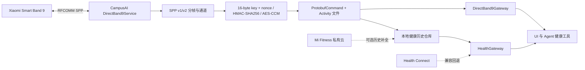

# Xiaomi Smart Band 9 直连可行性报告

> 分析日期：2026-08-26
> 分析阶段：源码与现有工件研究；尚未进行目标手机/固件动态验证
> 授权范围：[case scope](../work/xiaomi-mi-fitness-direct-band/scope.md)
> 重要限制：Band 9 的可复用实现主要来自 AGPL 项目；CampusAI 当前不是 AGPL 项目，不能直接复制或链接其实现后按现有方式分发。

> **2026-08-27 更正：** 实机与 Mi Fitness 3.58.0 静态验证已经完成。若 Mi Fitness/MiWearCore 必须保持运行，本报告中的“主应用直连推荐”不再成立；两者会竞争 Band 9 的单一 RFCOMM/SPP channel。请以[共存取数报告](2026-08-27_reverse-mi-fitness-stable-data-report.md)为准。

## 1. 结论

可以去掉 CaesarBandBridge 与 Gadgetbridge 常驻桥接，由 CampusAI 主应用直接连接 Xiaomi Smart Band 9。真正的“接口”不是公开 HTTP API，而是：

1. Android Bluetooth Classic RFCOMM/SPP 连接；
2. Xiaomi 应用层 16-byte 设备密钥认证；
3. 私有 Protobuf 命令与 Activity 文件通道；
4. 实时事件和历史数据解析后写入 CampusAI 自己的仓库。

Gadgetbridge 已给出完整、可审计的实现证据，因此不必从零盲猜协议。不过 Band 9 在其支持矩阵中仍属实验性，必须按准确型号、NFC/非 NFC、固件与地区版实机验证。[Gadgetbridge](https://github.com/Freeyourgadget/Gadgetbridge) 的 GitHub 镜像已归档，当前主库在 [Codeberg](https://codeberg.org/Freeyourgadget/Gadgetbridge)。

现代小米手环通常仍需先由官方 App 完成一次服务端绑定，从而生成设备专属 auth key；取得密钥后，可以停用 Mi Fitness 并由自己的 App 长期直连。解除绑定或硬重置后，密钥可能失效。[Gadgetbridge 配对说明](https://gadgetbridge.org/basics/pairing/huami-xiaomi-server/)

## 2. 路线对比

| 路线 | 是否真的直连手环 | 可用数据 | 主要限制 | 结论 |
|---|---:|---|---|---|
| CampusAI 内置 SPP 协议栈 | 是 | 实时心率/步数；daily、sleep、workout 等历史族 | 要 auth key；型号/固件差异；连接通道竞争；工程量最大 | 最符合目标，推荐 |
| Mi Fitness 私有云 API | 否 | 步数、热量、心率、体重、训练 | 需先由 Mi Fitness 同步上传；无实时；睡眠未确认；私有接口会变 | 快速去掉本地 bridge 的过渡路线 |
| HyperOS MiWearCore Binder | 表面上是 | 系统内部连接能力 | Binder 仅允许小米包名与证书 | 第三方 App 不可用 |
| 标准 BLE Heart Rate Service | 仅部分型号/固件 | 通常只有实时心率 | Band 9 不能默认假设存在；无完整历史 | 只能作为实机探测优化 |

## 3. Evidence → Finding → Path

### Scope 摘要

- 授权：用户自有应用、账号与可穿戴设备；只做互操作研究。
- 范围：Android APK、Bluetooth Classic SPP、BLE 发现、本地集成和只读私有云研究。
- 排除：第三方账号/设备、生产服务攻击、凭据外传。
- 完整记录：[scope.md](../work/xiaomi-mi-fitness-direct-band/scope.md) 与 [timeline.md](../work/xiaomi-mi-fitness-direct-band/timeline.md)。

### Evidence

| E-id | source_ref | content_hash | 复现入口 |
|---|---|---|---|
| E-001 | CampusAI 当前网关与 bridge 源码 | `sha256:d482…e42` | [证据](../work/xiaomi-mi-fitness-direct-band/evidence/E-001-current-integration.md) |
| E-002 | 解包的 HyperOS MiWearCore 服务 | `sha256:72c2…85ad`、`63f2…9e3b` | [证据](../work/xiaomi-mi-fitness-direct-band/evidence/E-002-mi-wear-core-gate.md) |
| E-003 | Gadgetbridge `a0948ee…` 的 Band 9/SPP/auth/health 源码 | Git commit 与六个 blob 固定 | [证据](../work/xiaomi-mi-fitness-direct-band/evidence/E-003-gadgetbridge-protocol.md) |
| E-004 | Mi Fitness MCP、huami-token、Band 9 recovery 的固定提交 | Git commit 与 blob 固定 | [证据](../work/xiaomi-mi-fitness-direct-band/evidence/E-004-cloud-and-key-tools.md) |
| E-005 | ADB 与本地 APK 清单 | `n/a` | [证据](../work/xiaomi-mi-fitness-direct-band/evidence/E-005-runtime-gap.md) |

### Findings

| F-id | 发现 | evidence_ids | confidence | location | status |
|---|---|---|---:|---|---|
| F-001 | Band 9 的主直连传输是 Bluetooth Classic SPP，不是一个公开 REST API | E-003 | 高 | `MiBand9Coordinator`, `XiaomiSppSupport` | 源码验证 |
| F-002 | 系统 bond 不足；需要 16-byte 设备密钥和 Xiaomi 应用层加密握手 | E-003, E-004 | 高 | `XiaomiAuthService`、绑定研究文档 | 源码/实机研究验证 |
| F-003 | 协议已有实时统计与历史活动文件实现，可覆盖的不仅是实时心率 | E-003 | 高 | `XiaomiHealthService`, activity fetcher/parser | 源码验证，目标固件待验 |
| F-004 | HyperOS MiWearCore 的导出 Binder 有小米证书白名单，CampusAI 无法合法调用 | E-002 | 高 | `MiWearCoreService`, `PermissionChecker` | 本地工件验证 |
| F-005 | 私有云可做历史过渡方案，但不是手环直连且睡眠尚未实现 | E-004 | 高 | `mi_fitness_cloud.py` | 源码验证 |
| F-006 | CampusAI 已有合适的 `BandLiveGateway` 替换缝；历史侧还需要本地仓库/新 HealthGateway | E-001 | 高 | app health package | 本地源码验证 |
| F-007 | Gadgetbridge 及 Band 9 recovery 派生项目是 AGPL；直接复制/链接会产生分发义务 | E-003, E-004 | 高 | upstream licenses | 已确认，具体合规需法务判断 |

### P-001：推荐直连 solve path

实现步骤：

1. 识别准确 Band 9 型号、NFC/非 NFC、固件、Mi Fitness 包版本和地区。
2. 用用户主动操作的一次官方绑定取得 auth key；优先通过受控导入或 [huami-token](https://github.com/argrento/huami-token)，密钥仅进入 Android Keystore 包装的本地 vault。
3. 在主应用增加 `connectedDevice` 前台服务：发现/配对、SPP socket、协议 v1/v2、重连与单连接所有权。
4. 实现 nonce/HMAC/AES-CCM 握手，认证成功后再开放 live/history 命令。
5. 先打通实时心率与累计步数，再实现 Activity 分块、校验、落盘后 ACK 和 daily/sleep/workout parser。
6. 用 `DirectBand9Gateway` 替换 `BandLiveProviderGateway`；历史数据写入本地仓库，由新 HealthGateway 读取，Health Connect 保留为兼容回退。
7. 建立固件样本回归；不支持的字段保持 `null/unavailable`，不能推断或伪造。

## 4. GitHub 实现审查

### Gadgetbridge

[型号支持矩阵](https://gadgetbridge.org/gadgets/wearables/xiaomi/) 将 Band 9 标为实验性，但源码已经包含：

- Band 9 的 `BT_CLASSIC` coordinator；
- Serial Port Profile、协议版本协商及 Protobuf/Activity 通道；
- `CMD_NONCE=26`、`CMD_AUTH=27` 的加密握手；
- 实时统计命令 45/46/47；
- 历史文件 fetch、校验、确认与 daily/sleep/workout 等 parser。

关键源码可直接核查：[认证实现](https://codeberg.org/Freeyourgadget/Gadgetbridge/src/branch/master/app/src/main/java/nodomain/freeyourgadget/gadgetbridge/service/devices/xiaomi/XiaomiAuthService.java)、[历史文件下载](https://codeberg.org/Freeyourgadget/Gadgetbridge/src/branch/master/app/src/main/java/nodomain/freeyourgadget/gadgetbridge/service/devices/xiaomi/activity/XiaomiActivityFileFetcher.java)、[历史解析器](https://codeberg.org/Freeyourgadget/Gadgetbridge/src/branch/master/app/src/main/java/nodomain/freeyourgadget/gadgetbridge/service/devices/xiaomi/activity/XiaomiActivityParser.java)。

### Band 9 recovery

[miband9-imu-recovery](https://github.com/glasses666/miband9-imu-recovery) 的恢复记录进一步确认：Android 已配对不代表应用层已认证，导入 Mi Fitness 中的设备 token/encrypt key 并完成 initialized 状态后，独立进程可直接同步。它是 Gadgetbridge 派生研究，许可证同样需要谨慎处理。

### 云端和老型号项目

- [mi-fitness-mcp](https://github.com/kubulashvili/mi-fitness-mcp)（MIT）是最接近“Mi Fitness API”的实现，但只是私有云历史接口。源码覆盖 steps/calories/heart_rate/weight/workouts，明确没有确认 sleep。
- [huami-token](https://github.com/argrento/huami-token)（MIT）适合取得已配对设备的密钥，但不是健康数据 reader。
- [miband4](https://github.com/satcar77/miband4)（MIT）展示老 Band 4 的直连与历史读取；协议代际不同，不能直接移植到 Band 9。
- [miband-heart-rate](https://github.com/Tnze/miband-heart-rate)（MIT）证明部分更新型号/固件可以广播标准 BLE 心率；这只能作为实机探测，不能替代 Band 9 全量私有协议。

## 5. 与当前 CampusAI 的改造边界

最小侵入方案不是重写 AI 工具层，而是替换健康网关底座：

| 当前组件 | 改造 |
|---|---|
| `BandLiveProviderGateway` | 新增 `DirectBand9Gateway`，直接读同进程连接状态和实时快照 |
| `HealthSyncCoordinator` | 去掉 Gadgetbridge/Bridge 文案与等待链，改为直连状态机 |
| `PairingTokenVault` | 移入主应用并把长度约束收紧到已验证的 key 格式；继续使用 Android Keystore 包装 |
| `HealthConnectGateway` | 保留为兼容数据源；新增本地历史仓库 gateway |
| Agent/UI 工具 | 基本不变，继续依赖 `HealthGateway` 与 `BandLiveGateway` |

需要注意，Mi Fitness、Gadgetbridge、HyperOS Mi Connect 与 CampusAI 可能争用同一 SPP 通道。直连模式应显式提示用户停用其它连接拥有者，并对抢占/断连做可恢复处理。

## 6. 未验证项与下一阶段输入

本轮没有连接手机，工作区也没有 Mi Fitness APK，因此以下内容不能声称已在用户设备上跑通：

- 准确型号（如 NFC/非 NFC）与固件对应的协议分支；
- auth key 的实际来源字段和导入格式；
- SPP v1/v2 协商结果、MTU/分块和重连时序；
- 该固件能否导出睡眠、SpO₂、压力和完整训练记录；
- HyperOS 对后台 Bluetooth、前台服务与通道抢占的实际行为。

下一阶段应先连接用户手机，仅采集包版本、设备型号/固件和授权的握手日志；任何账号 token 与设备密钥都必须脱敏，不进入终端参数、报告或 Git。

## 7. Timeline 摘要

1. 建立授权 scope 并盘点当前 bridge/Health Connect 链。
2. 审查本地 Mi Connect 系统 APK，排除证书门禁 Binder 路线。
3. 固定四个开源仓库提交并审查 Band 9 transport/auth/health、云接口和 key 工具。
4. 检查 ADB 与 APK 输入，确认动态阶段尚缺目标设备和 Mi Fitness APK。
5. 形成 P-001 同进程直连实现路径；等待用户选择后再进入动态验证或编码阶段。

完整追加记录见 [timeline.md](../work/xiaomi-mi-fitness-direct-band/timeline.md)。
