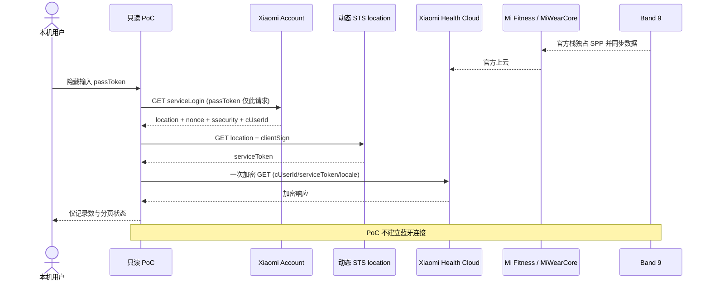

# Mi Fitness 3.58.0 云端只读接口逆向报告

> 分析日期：2026-08-27
> 目标：在 Mi Fitness 与 MiWearCore 保持运行的前提下，让 CampusAI 稳定读取已同步到小米健康云的数据
> 当前状态：静态协议恢复、一次中国区真实账号只读验收，以及 CampusAI 首版 `CN + steps + 手动刷新` 接入均已完成
> 敏感信息：真实凭据只经隐藏提示用于换票，未写入工件；未保存或输出账号标识、令牌、手环密钥、设备标识、原始响应或单条健康记录

## 1. 结论

中国区开源实现可以参照，但应限定在数据 key、响应结构变体和已观察行为，不能直接复制其网络层作为 Mi Fitness 3.58.0 的正确实现。目标 APK 证明了两个关键差异：健康历史接口是 `GET`，并且 `data` 与 `rc4_hash__` 两个排序字段共用同一个连续 RC4-drop-1024 密钥流。逐字段重置 RC4 或改发 POST 都可能导致服务端拒绝。

已经生成一个独立的纯标准库只读 PoC。默认模式完全离线，只处理合成向量；live 模式会执行两次账号换票请求和恰好一次允许列表内的健康数据 GET，只输出记录数与分页状态，不保存令牌或原始健康数据。

2026-08-27 的授权实测已经成功：CN 区 `steps` 一天窗口返回 `status=ok` 和 11 条记录，`has_more=false`。这证明当前账号与真实服务器接受恢复出的两跳换票、GET 请求、签名、连续 RC4-drop-1024 加解密链。`token_refreshed_in_memory=false` 只表示登录换票没有返回不同的 passToken，并非 401/serviceToken 刷新测试。它仍只是单次可用性证明，不等于长期稳定性测量。

这条路径不连接 Band 9，因此不会与 Mi Fitness/MiWearCore 争抢 Bluetooth Classic SPP。其“稳定”边界是：连接所有权冲突被消除，但数据新鲜度仍取决于官方 App 成功把手环数据同步到云端、网络、令牌有效性和小米私有接口兼容性；它不是秒级直读。

CampusAI 首版已经按这个边界落地：只有用户在原生设置页点击“验证并保存”或“刷新今日步数”才会访问小米云；应用启动、首页状态刷新和 Agent 健康查询只读 Android Keystore 包装的本地加密摘要。Mi Fitness 配置存在时，CampusAI 不查询、启动或同步 CaesarBandBridge/Gadgetbridge，缓存未命中也不用 Health Connect 数据冒充云端步数；只有未配置 Mi Fitness 时才保留原有 Health Connect 模式。

CampusAI 不能自行加入 Mi Fitness 本地 DataProvider 白名单。该白名单是 Mi Fitness 进程内的包名到签名证书映射，3.58.0 中没有生产写入点或外部注册入口。只有小米在官方组件中加入 CampusAI 的准确包名与发行签名证书，或给予系统级身份，才是符合现有信任模型的加入方式。

## 2. Scope 与分析对象

- 授权与边界：[scope.md](../work/xiaomi-mi-fitness-direct-band/scope.md)
- 连续操作记录：[timeline.md](../work/xiaomi-mi-fitness-direct-band/timeline.md)
- APK：`com.mi.health` 3.58.0 / version code 358000，SHA-256 `d784f3ca…b67c740`
- CampusAI application ID：`com.aistudio.campusai.ywtpzx`
- 允许行为：本地 APK 静态分析、公开源码核对、合成 fixture、离线单元测试、用户自有账号的只读 PoC
- 本轮动态范围：只执行用户自有账号的一次 CN `steps` 只读拉取；未执行网络抓包、写请求、修改或重签 Mi Fitness、root/Hook、PoC 蓝牙连接

## 3. 开源实现的参考边界

| 项目/版本 | 许可证 | 可以借鉴 | 不能作为当前协议真值的原因 |
|---|---|---|---|
| `binglua/mi-fitness-mcp-cn` `7fcd069…` | MIT | 中国区 metric key、睡眠/SpO₂/压力响应变体 | 网络加密链仍需按 APK 3.58.0 校正 |
| `kubulashvili/mi-fitness-mcp` `07b6190…` | MIT | 登录状态、端点假设、测试组织 | 固定版本逐字段重置 RC4，且 app/v1 请求方法与 APK 不一致 |
| `shkyyy18/mi_fitness_data_bridge` `304c7f2…` | AGPL-3.0-only | 行为、数据结构和实际账号成功声明的旁证 | 当前实现同样存在 POST/RC4 差异；复制会引入 AGPL 义务 |
| Mi Fitness 3.58.0 APK | 专有 | 当前客户端实际调用链、字段、算法、区域逻辑 | 已由一次 CN `steps` 真实只读请求验证；其他区域、指标和长期兼容性仍未知 |

PoC 采用独立最小实现；GPL/AGPL 项目只作事实旁证。完整来源与许可证边界见 [NOTICE.md](../work/xiaomi-mi-fitness-direct-band/poc/mi_fitness_cloud_readonly/NOTICE.md)。

## 4. 协议恢复结果

### 4.1 消息类型表

| 消息 | 方向 | 方法与位置 | 关键字段 | 结果 |
|---|---|---|---|---|
| 账号会话 | C→S | `GET account.xiaomi.com/pass/serviceLogin` | `sid=miothealth`, `_json`, `appName`, `_locale`; Cookie 中 `userId/passToken/deviceId` | `location`, `ssecurity`, `nonce`, `cUserId` |
| STS 换票 | C→S | `GET <动态 location>` | `clientSign`, `_userIdNeedEncrypt=true`; Cookie 中 `cUserId/deviceId` | `miothealth_serviceToken` 或 `serviceToken` |
| 健康历史 | C→S | `GET /app/v1/data/get_fitness_data_by_time` | 加密前 JSON：`key,start_time,end_time,reverse,next_key` | `data_list,has_more,next_key` |
| 运动历史 | C→S | `GET /app/v1/data/get_sport_records_by_time` | 加密前 JSON：`category,start_time,end_time,reverse,next_key,limit` | `sport_records,has_more,next_key` |
| 健康响应 | S→C | HTTP body | Base64(RC4-drop-1024(JSON)) | `code/status`, `msg`, `result` |

外层成功码在 APK 模型中接受 `0` 或 `200`。fitness/sport 单条记录的 `value` 仍是按 `key` 区分的 JSON 字符串，真实字段映射需在 live 响应确认后冻结。

### 4.2 签名与加密

1. `_nonce = Base64(random[8] || big_endian_uint32((unix_ms + timeDiff) / 60000))`。
2. `signedNonce = SHA-256(Base64Decode(ssecurity) || Base64Decode(_nonce))`。
3. 签名明文为大写 HTTP 方法、完整 `/app/v1/...` path、按 key 排序的 `k=v` 和 signedNonce Base64，以 `&` 拼接；结果为 SHA-1/Base64。
4. 先加入明文 `rc4_hash__`，只创建一个 RC4 对象并丢弃前 1024 字节，然后按排序顺序连续加密全部字段值。
5. 对加密后的 map 再签名，附加 `_nonce`；响应用相同派生密钥新建 RC4-drop-1024 流解密。

合成证据摘录：

```text
nonce hex:
00010203040506070000002a

signedNonce hex:
a15ec3ba390c242aed22b789a0cef9daf58e4622c4f6c62618d6cc3cb83786c4

encrypted response prefix, 32/162 bytes:
837bff65ad29a53889a3c754c66aeb2c3ab167f255b455e55397e62fb0181c0c

decoded safe summary:
{"cursor_present":false,"endpoint":"/app/v1/data/get_fitness_data_by_time","has_more":false,"metric":"steps","mode":"offline-vector","record_count":1,"status":"ok"}
```

### 4.3 调用路径



## 5. Evidence → Finding → Path

### Evidence

| E-id | source_ref | repro_command | content_hash | 观察 |
|---|---|---|---|---|
| E-004 | 固定 Mi Fitness 云端 OSS 源码 | 见证据文件 | 固定 commit/blob | 私有健康云路线存在，但上游实现只是假设来源 |
| E-006 | 手机只读 Bluetooth/服务状态 | 见证据文件 | n/a，运行时环形缓冲 | 官方栈运行时不能保证第二个 SPP 客户端稳定共存 |
| E-008 | APK 3.58.0 + 独立 PoC/fixture/tests | `py -3 -m unittest discover -s tests -v` | `47bbec76…720f` | GET、连续 RC4、两跳换票和只读边界已离线验证 |
| E-009 | `DataProviderManager` / `DataContentProvider` | Java + smali 全局调用点搜索 | `8df26f59…ac4c5` | 白名单无生产写入点或外部注册接口 |
| E-010 | 用户授权的 CN `steps` live PoC | `py -3 readonly_poc.py --live --metric steps --days 1 --region cn --utc-offset +08:00` | `ce2bf8c…d8f1`，安全摘要截图 | 两跳换票、加密 GET 和响应解密获真实服务器接受；一天窗口 11 条，无后续页信号 |
| E-011 | CampusAI Android 源码、单测与 debug APK | `testDebugUnitTest`; `assembleDebug` | APK `43890612…4ccc8e3` | 手动只读、加密缓存、取消/超时、配置后 fail-closed、Agent/Band 隔离完成；201 测试通过 |

证据详情：[E-008](../work/xiaomi-mi-fitness-direct-band/evidence/E-008-mi-fitness-cloud-protocol.md)、[E-009](../work/xiaomi-mi-fitness-direct-band/evidence/E-009-mi-fitness-whitelist-gate.md)、[E-010](../work/xiaomi-mi-fitness-direct-band/evidence/E-010-mi-fitness-cloud-live-read.md)。

### Findings

| F-id | 发现 | severity | evidence_ids | confidence | location | status |
|---|---|---|---|---:|---|---|
| F-013 | 中国区 OSS 可作字段/行为参考，不能覆盖目标 APK 的网络实现 | `n/a_re` | E-004, E-008 | 高 | pinned OSS 与 `FitnessApiService`, `ri4` | validated |
| F-014 | Mi Fitness 3.58.0 的两个最小历史接口均为 GET，且参数加密使用连续 RC4 流 | `n/a_re` | E-008 | 高 | `FitnessApiService.java:74-76,134-136`; `ri4.java:16-38` | validated |
| F-015 | `sid=miothealth` 使用 serviceLogin + 动态 location 的固定两跳换票链 | `n/a_re` | E-008 | 高 | `XMPassport.java:636-662,1025-1030,2214-2251` | validated statically |
| F-016 | CampusAI 不能从普通应用进程把自己加入 Mi Fitness 白名单 | `n/a_re` | E-009 | 高 | `DataProviderManager`, `DataContentProvider` | validated |
| F-017 | E-008 的离线 PoC 证明内部算法与安全边界自洽；其服务端验收缺口仅由后续 E-010 对 CN/steps 单窗口补足 | `n/a_re` | E-008, E-010 | 高 | `poc/mi_fitness_cloud_readonly` | live gap partially closed |
| F-018 | 当前 CN 账号的真实服务器接受恢复出的两跳换票、加密 GET 与响应解密链 | `n/a_re` | E-010 | 高 | `get_fitness_data_by_time`, `steps`, one-day window | validated live once |

### P-003：不争抢手环的只读取数路径

- path_type: `solve`
- start: Mi Fitness/MiWearCore 继续作为唯一蓝牙 owner
- goal: CampusAI 获得官方栈已经上云的健康历史
- steps:
  1. 官方栈从 Band 9 同步并上云 — evidence: E-006, E-010 — finding: F-018
  2. 本机用 passToken 交换动态 STS 会话 — evidence: E-008, E-010 — finding: F-015, F-018
  3. 对允许列表内的 app/v1 GET 做签名、连续 RC4 加密和响应解密 — evidence: E-008, E-010 — finding: F-014, F-018
  4. 仅解析并缓存经验证字段，保留来源与最后同步时间；CampusAI 不启动 BandBridge/Gadgetbridge — evidence: E-004, E-008, E-010 — finding: F-013, F-018
- residual_risks: 私有接口变更、账号风控、服务端时间差、令牌刷新、分页、云同步延迟、非 steps schema 和长期运行可靠性尚未验收

## 6. PoC 与复现

PoC 入口：[README.md](../work/xiaomi-mi-fitness-direct-band/poc/mi_fitness_cloud_readonly/README.md)

```powershell
Set-Location 'work/xiaomi-mi-fitness-direct-band/poc/mi_fitness_cloud_readonly'
py -3 -m py_compile readonly_poc.py tests/test_readonly_poc.py
py -3 -m unittest discover -s tests -v
py -3 readonly_poc.py
```

当前结果：18 个纯离线测试通过，默认 CLI 只输出七个摘要字段。测试覆盖固定签名/RC4 向量、响应解密、两跳 fake-opener 登录、动态 location 参数、Cookie 域隔离、代理禁用、精确 payload、区域与端点允许列表，以及所有写方法不可表示。

真实验收命令由用户在本机显式运行，passToken 通过隐藏提示输入，不应粘贴到聊天或命令行：

```powershell
py -3 readonly_poc.py --live --metric steps --days 1 --region cn --utc-offset +08:00
```

授权实测安全摘要：

```json
{"cursor_present":false,"endpoint":"/app/v1/data/get_fitness_data_by_time","has_more":false,"metric":"steps","mode":"read-only","record_count":11,"region":"cn","status":"ok","token_refreshed_in_memory":false}
```

当前只 live 验证了一个 `steps` 时间窗。CampusAI 实现已经补上最多 10 页/10,000 条的有界分页、重复 cursor 检测、范围校验、聚合上限、单次 unique WorkManager 与凭据刷新持久化；服务器 `Date/timeDiff`、真实多页响应和长期私有接口兼容性仍是残余边界。睡眠/SpO₂/压力尚未接入，必须逐项冻结真实 schema 后再开放。

## 7. CampusAI 首版实现与未验证边界

- 当前账号的一次 CN 请求没有触发额外挑战，但不能据此承诺后续不会遇到验证码或设备风控。
- PoC 尚未从服务器 `Date` 保存 `timeDiff`；本机时间偏差可能导致签名失败。
- 非 CN 区域映射来自 APK/OSS 静态旁证，未 live 验证。
- PoC 只使用系统 TLS 信任库，没有额外证书 pinning。
- 云端不会争抢蓝牙，但数据更新速度不是实时保证。
- 已新增独立 `MiFitnessStepsSyncWorker` 与 `MiFitnessStepsSyncScheduler`。它们只创建用户触发的 one-time unique work，没有周期任务；input `Data` 为空，失败 output 只有允许列表内的错误码。
- 凭据和聚合摘要都经现有 Android Keystore 包装的 `SecurePreferences` 加密，且该偏好文件已从云备份和设备迁移中排除。没有复用可备份的 Room `health_summary_cache`，也不落盘原始响应、分页记录、serviceToken、ssecurity 或 deviceId。
- `HealthGatewayFactory.create()` 只在未配置 Mi Fitness 时允许 Health Connect fallback；配置后云端缓存缺失会 fail-closed，不混合也不冒充。Health Connect 授权 Activity 使用独立 `createHealthConnectOnly()`。
- 网络调用与协程取消绑定，单次 Call 有超时，整个同步上限 90 秒；刷新中删除凭据会先取消 Work。Agent 还会在执行时校验本轮 projected-tool allowlist。
- 完整 Android 单测 201/201 通过，`assembleDebug` 与 `lintDebug` 成功（Lint 0 fatal / 0 error）；实现验证过程未访问真实小米云。证据见 [E-011](../work/xiaomi-mi-fitness-direct-band/evidence/E-011-campusai-mi-fitness-integration.md)。
- `CaesarAppTools` 的健康工具不再持有 Band gateway 或 `HealthSyncCoordinator`，只调用 `HealthGateway.snapshot()`；Agent 不能启动实时会话、历史同步或云端刷新。
- Profile、首页和 AI 设置均展示固定安全状态。凭据输入不使用 saveable 状态，passToken 始终遮罩；成功后清空输入，删除时同时删除凭据与摘要。
- 首版仅开放中国区当天 steps。分桶求和语义仍标记为 provisional，首次成功结果应与 Mi Fitness 当天总步数人工对照；没有记录不得由 UI 推断成 0。

## 8. Timeline 摘要

1. 2026-08-26：确认 Band 9 直连为 Bluetooth Classic SPP，识别与官方栈的所有权冲突。
2. 2026-08-27：只读诊断手机，并静态确认 Health Connect inland gate 与本地 Provider 特权门禁。
3. 2026-08-27：对照固定 OSS 与 APK 3.58.0，纠正 GET、请求模型和连续 RC4 语义。
4. 2026-08-27：完成两跳登录、凭据隔离、只读端点允许列表及 18 个离线测试。
5. 2026-08-27：确认 DataProvider 白名单无自注册入口，保留云端路线为大陆区首选。
6. 2026-08-27：完成一次用户授权的 CN `steps` live read；真实服务器返回 11 条记录且没有后续页信号。
7. 2026-08-27：完成 CampusAI 首版只读接入：显式手动联网、Keystore 加密凭据/摘要、cache-first 网关、Agent/Band 隔离和固定安全 UI。
8. 2026-08-27：全量 201 个 Android 单测与 debug APK 构建通过，并完成取消/超时、fail-closed 与 projected-tool 执行白名单复核。

完整记录见 [timeline.md](../work/xiaomi-mi-fitness-direct-band/timeline.md)。
