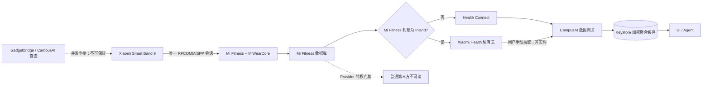

# Xiaomi Smart Band 9 与 Mi Fitness 共存取数报告

> 分析日期：2026-08-27
> 目标约束：Mi Fitness 与 HyperOS Mi Connect/MiWearCore 保持运行，不停止、不禁用、不与其争抢手环连接
> 授权范围：[case scope](../work/xiaomi-mi-fitness-direct-band/scope.md)
> 敏感信息：设备 key、账号标识、MAC 与 ADB 序列号均未写入命令、证据或报告

## 1. 结论

**不能通过 Gadgetbridge 配置、重试或普通补丁，保证它与 Mi Fitness/MiWearCore 同时稳定直连 Band 9。** Band 9 在 Gadgetbridge 中明确使用 Bluetooth Classic，具体承载是标准 SPP UUID；Android RFCOMM 同一 channel 同时只允许一个 connected client。auth key 只解决 socket 建立后的应用层认证，不会赋予连接优先级，也不能共享同一个 SPP 会话。

因此，在“完全不动官方服务”的硬约束下，应撤回此前的主应用直连推荐：让 Mi Fitness/MiWearCore 成为唯一 Bluetooth owner，CampusAI 只读取官方栈同步后的下游数据。

当前中国大陆环境的现实优先级是：

1. **Mi Fitness 私有健康云 → CampusAI 手动只读拉取 → Keystore 加密摘要**：不争抢蓝牙，最符合当前约束；首版固定中国区当天步数，不做周期任务，但接口非公开，仍存在版本变化风险。
2. **Mi Fitness → Health Connect → CampusAI**：接口边界最正规，但 Mi Fitness 3.58.0 在 `RegionManager.isInland()` 为真时明确不启动这条同步；当前手机上的 Mi Fitness 写权限也全部未授予。静态代码还不能证明失败重试一定会被调度，因此仍需实机测同步延迟。
3. **Gadgetbridge/CampusAI 直连 SPP**：只能作为“官方栈主动让出连接”的独占模式，不能作为共存生产方案。

如果“稳定”还要求秒级实时、完整睡眠/血氧、长期不受私有接口变化影响，那么这三个条件与“官方服务完全不动”目前无法同时满足，必须放宽至少一个约束。

## 2. 为什么 key 不能修复连接

Gadgetbridge 的 `MiBand9Coordinator` 返回 `BT_CLASSIC`，`XiaomiSppSupport` 使用 Serial Port Profile 服务并在 socket 连接后才进入版本协商、nonce、HMAC 与 AES-CCM 认证。Android 官方文档则规定 RFCOMM 每个 channel 同时只有一个 connected client。

这将问题分成两层：

| 层 | key 能否解决 | 当前结论 |
|---|---:|---|
| RFCOMM/SPP 连接所有权 | 否 | Mi Fitness/MiWearCore 与第三方客户端竞争同一通道 |
| Xiaomi 应用层认证与加密 | 是 | 第三方取得 socket 后可通过认证，但并不保证 socket 能保住 |

Gadgetbridge 自己的配对文档也要求连接前撤销 vendor app 权限或卸载它，并在排障中要求 vendor app 不运行，因为它会与 Gadgetbridge 冲突。这和用户要求的共存条件正好相反。

可通过状态机、前台服务、指数退避改善“没有竞争者时”的恢复速度；不能把一个单客户端 channel 变成两个客户端可稳定共享。更激进的抢连只会让两套栈互相踢下线。

## 3. 手机与 APK 实证

### Scope 摘要

- 资产：用户自有 Band 9、HyperOS 手机、Mi Fitness 3.58.0 与 CampusAI。
- 行为：只读 ADB 诊断、APK 静态逆向和公开源码核验。
- 排除：停止/禁用服务、修改系统设置、读取健康内容、外传密钥或账号标识。
- 完整记录：[scope.md](../work/xiaomi-mi-fitness-direct-band/scope.md) 与 [timeline.md](../work/xiaomi-mi-fitness-direct-band/timeline.md)。

### Evidence

| E-id | source_ref | content_hash | 观察 |
|---|---|---|---|
| E-003 | Gadgetbridge Band 9/SPP/auth 源码 | 固定 Git commit/blob | Band 9 走 Classic SPP，认证发生在 socket 之上 |
| E-004 | Mi Fitness cloud OSS 实现 | 固定 Git commit/blob | 私有健康云可读步数、热量、心率、体重和训练；睡眠未确认 |
| E-006 | 手机只读 `dumpsys` | `n/a`，运行时环形缓冲 | 官方栈运行时出现严重 Classic 连接抖动；每次事件的发起包不可从该 dump 确定 |
| E-007 | Mi Fitness 3.58.0 APK | `sha256:d784f3ca…b67c740` | Health Connect 有 inland gate；健康 Provider 有内部特权门禁 |
| E-011 | CampusAI Android 实现与构建 | `sha256:43890612…4ccc8e3` | 配置后只读加密云缓存，不会回退或抢占手环；201 测试与 debug 构建通过 |

详细证据：[E-003](../work/xiaomi-mi-fitness-direct-band/evidence/E-003-gadgetbridge-protocol.md)、[E-004](../work/xiaomi-mi-fitness-direct-band/evidence/E-004-cloud-and-key-tools.md)、[E-006](../work/xiaomi-mi-fitness-direct-band/evidence/E-006-phone-coexistence.md)、[E-007](../work/xiaomi-mi-fitness-direct-band/evidence/E-007-mi-fitness-3.58-static.md)。

### Findings

| F-id | 发现 | severity | evidence_ids | confidence | location | status |
|---|---|---|---|---:|---|---|
| F-008 | Band 9 的单个 SPP channel 不能由两个普通客户端稳定共享 | `n/a_re` | E-003, E-006 | 高 | `MiBand9Coordinator`, `XiaomiSppSupport`, Android RFCOMM | validated |
| F-009 | 提供正确 key 只解决应用层认证，不解决连接所有权 | `n/a_re` | E-003, E-006 | 高 | `XiaomiAuthService` 之前的 socket 生命周期 | validated |
| F-010 | Mi Fitness 3.58.0 的 Health Connect 同步在 inland 区域被显式跳过 | `n/a_re` | E-007 | 高 | `HealthConnectComponent.checkAndStartSync` | validated |
| F-011 | 导出的 Mi Fitness 健康 ContentProvider 不是普通第三方 API | `n/a_re` | E-007 | 高 | `DataContentProvider`, `DataProviderManager`, `y86` | validated |
| F-012 | 私有健康云不会争抢本地 SPP，但接口与字段完整性没有官方兼容保证 | `n/a_re` | E-004 | 高 | `mi_fitness_cloud.py` | validated with residual risk |

### P-002：共存稳定取数路径

调用路径：

1. Band 9 只与 Mi Fitness/MiWearCore 建立 SPP 会话 — E-003、E-006 — F-008。
2. 官方栈完成认证、历史同步和云上传 — E-003、E-004 — F-009。
3. 非 inland 环境由 Health Connect 导出；inland 环境改为只读私有云 — E-004、E-007 — F-010、F-012。
4. CampusAI 只在用户显式点击时做有界分页、范围校验、来源标记和加密聚合缓存；UI/Agent 平时只读缓存，永远不等待或连接手环。
5. Mi Fitness 配置后缓存未命中即 fail-closed，不将 Health Connect 冒充为云数据；手动 Work 可取消且有总超时，Agent 只能执行本轮投影的健康读取工具。

残余风险：私有云可能改签名/响应结构；Health Connect 延迟取决于 Mi Fitness，且 APK 中存在的 retry scheduler 未找到已验证调用点；云路线的睡眠字段仍需目标账号实测。

## 4. 可实现的稳定方案

建议将 CampusAI 的健康数据层改为 `OfficialDataGateway`，不要再让 `HealthSyncCoordinator` 启动 Gadgetbridge 或 CaesarBandBridge：

| 组件 | 职责 |
|---|---|
| `MiFitnessCloudGateway` | 按时间游标拉 steps/calories/heart_rate/workouts，处理区域域名、签名、重试与限流 |
| `HealthConnectGateway` | 仅在 Mi Fitness 实际写入时启用；不能把“声明权限”当作“同步已开启” |
| `OfficialDataRepository` | 合并数据源、按 source ID/时间去重，写入 Room |
| `FreshnessPolicy` | 展示最后同步时间和来源；超时显示 stale，不伪装成实时数据 |
| `BandLiveGateway` | 共存模式返回 cached/unavailable；只有用户明确进入独占模式才启动 SPP |

首版可靠性策略：

- WorkManager 仅运行用户触发的 one-time unique work；应用启动、Agent 查询和普通页面刷新不联网。
- 网络成功且数据库事务落盘后再推进 cursor；失败采用指数退避。
- 云 token 只存 Android Keystore 包装的本地凭据仓，不进入源码、日志、Crashlytics 或终端参数。
- 只保存当天聚合步数、记录数、匿名账号 scope、日期、来源与同步时间；不保存单条记录或原始响应。
- 先实测睡眠响应再承诺睡眠；没有字段时明确标为 unsupported。

## 5. 边界与更正

本报告取代 [2026-08-26 直连可行性报告](2026-08-26_reverse-xiaomi-band9-direct-report.md) 在“官方栈保持运行”条件下的直连推荐。直连协议本身仍然可实现；变化的是连接所有权约束被实机数据和 RFCOMM 规范验证后，不能再把它描述成稳定共存方案。

本轮没有停止、禁用、清数据、解绑或修改 Mi Fitness/Mi Connect，也没有用用户提供的 key 发起连接。Bluetooth dump 能证明严重抖动和 SPP 单通道限制，但不能逐条证明是哪个包主动断开，因此报告只把“争用”判为与证据一致的机制，不虚构每次断连的责任方。

## 6. 来源

- [Android Bluetooth Classic：RFCOMM 每个 channel 同时只允许一个 connected client](https://developer.android.com/develop/connectivity/bluetooth/connect-bluetooth-devices)
- [Gadgetbridge Band 9 coordinator：`BT_CLASSIC` 且仍为 experimental](https://github.com/Freeyourgadget/Gadgetbridge/blob/master/app/src/main/java/nodomain/freeyourgadget/gadgetbridge/devices/xiaomi/miband9/MiBand9Coordinator.java)
- [Gadgetbridge Xiaomi SPP：Serial Port Profile 与 Protobuf/Activity channel](https://github.com/Freeyourgadget/Gadgetbridge/blob/master/app/src/main/java/nodomain/freeyourgadget/gadgetbridge/service/devices/xiaomi/XiaomiSppSupport.java)
- [Gadgetbridge 配对/排障：vendor app 会冲突，连接时不应运行](https://gadgetbridge.org/basics/pairing/huami-xiaomi-server/)

## 7. Timeline 摘要

1. 2026-08-26：确认 Band 9 的 SPP、认证、Protobuf 与历史文件路径。
2. 2026-08-27：连接用户手机，只读采集 Mi Fitness/MiWearCore 状态与 Classic 连接历史。
3. 2026-08-27：静态逆向 Mi Fitness 3.58.0，确认 Health Connect inland gate 和本地 Provider 特权门禁。
4. 2026-08-27：将推荐架构改为官方栈唯一连接、CampusAI 从下游取数。

完整记录见 [timeline.md](../work/xiaomi-mi-fitness-direct-band/timeline.md)。
